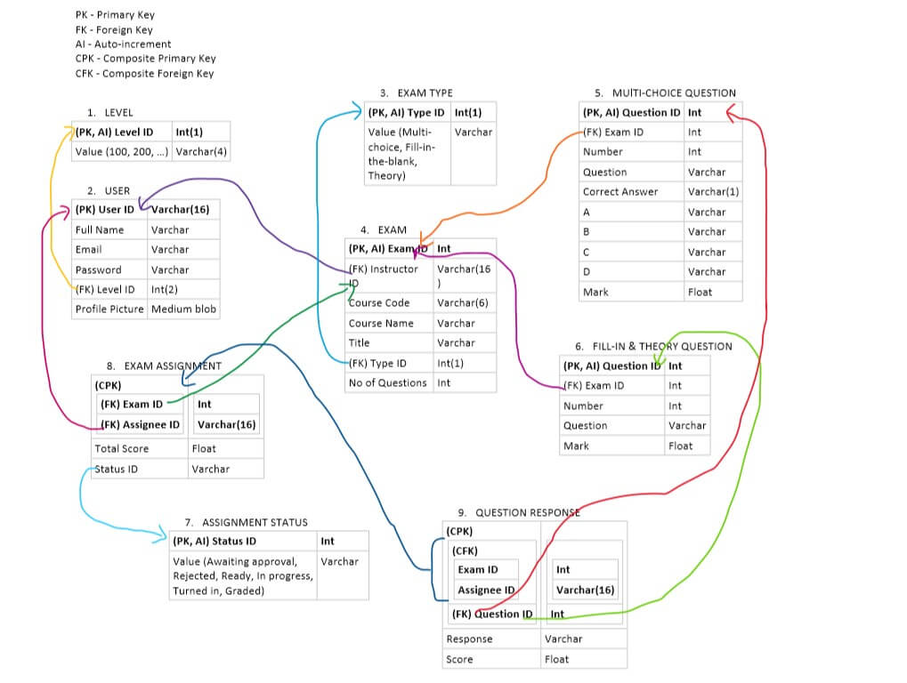

How to: Online Exam Portal
===

Contents
---
- [How to: Online Exam Portal](#how-to-online-exam-portal)
  - [Contents](#contents)
  - [Outline](#outline)
    - [Sign up](#sign-up)
    - [Sign in](#sign-in)
      - [Password Forgotten??](#password-forgotten)
    - [Dashboard](#dashboard)
    - [My Quizzes (for lecturer*)](#my-quizzes-for-lecturer)
    - [Exams (for student*)](#exams-for-student)
    - [Create Exam (for lecturer*)](#create-exam-for-lecturer)
      - [Multi-choice questions](#multi-choice-questions)
    - [Update Profile](#update-profile)
  - [Naming Convention](#naming-convention)
    - [File/Folder](#filefolder)
    - [HTML/CSS](#htmlcss)
    - [JavaScript](#javascript)
    - [PHP](#php)
    - [SQL/DB](#sqldb)
  - [Database Structure](#database-structure)
    - [Tables](#tables)
    - [Procedure](#procedure)
      - [Sign Up](#sign-up)
      - [Sign In](#sign-in)
      - [Recover Password](#recover-password)
      - [Reset Password](#reset-password)
      - [Profile Page](#profile-page)
      - [Create Exam](#create-exam)
      - [Exams](#exams)
      - [My Quizzes](#my-quizzes)
    - [?What to do with files](#what-to-do-with-files)
    - [Expiring Token](#expiring-token)


Outline
---

### Sign up
* Name
* Student Reg No (optional)
* Level (optional)
* Passport photo
* Email
* Username
* Password

### Sign in
* Username
* Password

#### Password Forgotten??
* Ask for email address
* If it exists in database, send a email to the address containing a link to reset the password.
* The link should have an expiry time.

### Dashboard
* My Quizzes
* Exams
* Create Exam
* Update Profile
* Sign out

### My Quizzes (for lecturer*)
* See all your created quizzes here.
* You can:
  * edit or delete.
  * assign to students using username or email.
  * list students with their info (name, id, level, dept, score) for each quiz
  * grade students and return grades.
  * generate excel sheet for all students.*
  * print grade list of all students.*

### Exams (for student*)
* See all quizzes assigned to you.
* Take quizzes and get results. (Immediate results for multi-choice)
* Accept/reject invitation to take quiz.

### Create Exam (for lecturer*)
* Create an exam
* Choose no of questions
* Choose type of questions (multi-choice, theory or fill in the blank)
* All quizes must have a unique auto-generated code.
* You can share the code to students or assign the quiz to them using their username or email.

#### Multi-choice questions
* Give questions and answers.

### Update Profile
* Update any profile details besides the username.

Naming Convention
---

### File/Folder
* Name -> `myfile.txt`, `my-file.txt`

### HTML/CSS
* Class, ID, form input name -> `class-name`, `element-id`, `input-name`

### JavaScript
* Variable -> `myVariable`
* Constant -> `MY_CONSTANT`
* Function -> `doSomething()`

### PHP
* Variable -> `$myVariable`
* Constant -> `MY_CONSTANT`
* Function -> `doSomething()`
* Class -> `MyClass`
* Keyword -> `true`

### SQL/DB
* Command/keyword -> `SELECT`
* Database, table & field/column name -> `my_database`, `exam`, `user_id`
* Use singular names for tables, fields, etc. -> `response` table (not `responses`), `email` field (not `emails`)

Database Structure
---



### Tables

1. **User Profile** stores user profile data

2. **Exam** stores exam info (not including the questions)

3. **Assignment** stores exam assignment info (i.e. which exam has been assigned to which user), and the user's score in the exam, and status of the assignment (whether the user has started it, completed it, etc.).

4. **Multi-choice Question** stores info about multi-choice questions, like the exam to which a question belongs, the question number, mark, correct answer, the options and the question itself.

5. **Fill-in the blank & Theory Question** stores info about the other two question types.

6. **Question Response** stores data about the user's responses to questions. So it holds the responses, the scores of the responses, and the question and asignment IDs to which the response belongs.

7. **Level** is a lookup table to store the different possible levels. It's like an 'enum' in programming languages.

8. **Exam Type** is a lookup table to store the types of exams.

9. **Status** is another lookup table. It stores exam assignment status.

### Procedure

**NB:**
* 'Main pages' here refers to all pages that have the dashboard (i.e. excluding sign up, sign in and the likes).
* The current session must validated at the top of main pages
* To do that you can include (or require) '/code/session.php' at the top. (Make sure to include with appropriate path tho).
* The HTML template for a basic 'main page' can be found at '/code/index.php'


#### Sign Up
* Collect user details
* Rename uploaded picture to something like 'abcdefgh123.jpg'
* Insert the details into 'user' table
* Create session for user (the session would be used to keep the user logged in)

#### Sign In
* Collect user input
* Check it against records in 'User Profile' table
* If user ID doesn't exist, suggest signing up *
* If password incorrect, suggest recovering it *
* Create session for user

#### Recover Password
* Get email
* Validate email for that user ID
* (What to do next?)

#### Reset Password
* Get new password
* Update db

#### Profile Page
* Get new profile details (except user ID)
* Update the record for the user ID in 'User Profile' table.

#### Create Exam
* Get exam details (course code, course name, exam title, type, no of questions)
* Get instructor ID from the current user's ID
* Insert the data into 'Exam' table
* For a multi-choice question:
  * Get each question, along with its mark and correct answer
  * That data goes into the 'Multi-choice Question' table.
  * Get the options for the question
  * Insert them into the 'Options Group' table.
* For a fill-in-the-blank/theory question:
  * Get each question, along with its mark
  * Insert the data into the 'Fill-in the Blank & Theory' table
* Get user IDs of assigned students
* Insert user IDs, and exam ID and status into 'Assignment' table. Status ID should point to 'Awaiting approval' initially.
* Return exam ID to user.

#### Exams
* Select exam details of all exams assigned to (and not rejected by) current user. Print to screen.
* When user decides to take a multi-choice exam:
  * Set assignment status ID to indicate 'In progress'
  * Select all question details from the 'Multi-choice Question' table, where the exam ID belongs to the exam chosen by the user.
  * Print to screen
  * When user is done:
    * Get user's responses details (question id, assignment id, reponse) and insert into 'Question Response' table.
    * Set assignment status ID to indicate 'Turned in'
    * Check each response against the correct answer for the question
    * Set the score field for each response in 'Question Response'.
    * Sum all the scores to get the total.
    * Set the total score field of the 'Assignment' table to the calculated total
    * Set assignment status ID to indicate 'Graded'
    * Notify student
* When user decides to take other exams:
  * Set assignment status ID to indicate 'In progress'
  * Select all question details from the 'Fill-in ... Question' table, where the exam ID belongs to the exam chosen by the user.
  * Print to screen
  * When user is done:
    * Get user's responses details (question id, assignment id, reponse) and insert into 'Question Response' table.
    * Set assignment status ID to indicate 'Turned in'
    * Notify instructor to grade exam
    * Set the score field for each response in 'Question Response' table to the score given by the instructor.
    * Sum all the scores to get the total.
    * Set the total score field of the 'Assignment' table to the calculated total
    * Set assignment status ID to indicate 'Graded'
    * Notify student.
* When user accepts exam invitation, set assignment status ID to indicate 'Ready'.
* When user rejects exam invitation, set assignment status ID to indicate 'Rejected'.

#### My Quizzes
* Select fields from the 'Exam' table where the instructor ID is the current users ID, and print to screen
* _(I'd leave the rest for now...)_

> **NB**: What happens when an exam is deleted?


### ?What to do with files
```php
<?php

header('Content-Type: text/plain; charset=utf-8');

try {

    // Undefined | Multiple Files | $_FILES Corruption Attack
    // If this request falls under any of them, treat it invalid.
    if (
        !isset($_FILES['upfile']['error']) ||
        is_array($_FILES['upfile']['error'])
    ) {
        throw new RuntimeException('Invalid parameters.');
    }

    // Check $_FILES['upfile']['error'] value.
    switch ($_FILES['upfile']['error']) {
        case UPLOAD_ERR_OK:
            break;
        case UPLOAD_ERR_NO_FILE:
            throw new RuntimeException('No file sent.');
        case UPLOAD_ERR_INI_SIZE:
        case UPLOAD_ERR_FORM_SIZE:
            throw new RuntimeException('Exceeded filesize limit.');
        default:
            throw new RuntimeException('Unknown errors.');
    }

    // You should also check filesize here.
    if ($_FILES['upfile']['size'] > 1000000) {
        throw new RuntimeException('Exceeded filesize limit.');
    }

    // DO NOT TRUST $_FILES['upfile']['mime'] VALUE !!
    // Check MIME Type by yourself.
    $finfo = new finfo(FILEINFO_MIME_TYPE);
    if (false === $ext = array_search(
        $finfo->file($_FILES['upfile']['tmp_name']),
        array(
            'jpg' => 'image/jpeg',
            'png' => 'image/png',
            'gif' => 'image/gif',
        ),
        true
    )) {
        throw new RuntimeException('Invalid file format.');
    }

    // You should name it uniquely.
    // DO NOT USE $_FILES['upfile']['name'] WITHOUT ANY VALIDATION !!
    // On this example, obtain safe unique name from its binary data.
    if (!move_uploaded_file(
        $_FILES['upfile']['tmp_name'],
        sprintf('./uploads/%s.%s',
            sha1_file($_FILES['upfile']['tmp_name']),
            $ext
        )
    )) {
        throw new RuntimeException('Failed to move uploaded file.');
    }

    echo 'File is uploaded successfully.';

} catch (RuntimeException $e) {

    echo $e->getMessage();

}

?>
```

### Expiring Token
* When your user requests a password reset, generate a token and calculate its expiry date
* Store the token and its expiry date in separate columns in your users table for that user
* Send an email to the user containing the reset link, with the token appended to its URL
* When your user follows the link, grab the token from your URL (perhaps with `$_GET['token']`)
* Verify the token against your users table
* Check that it's not past its expiry date yet
* If it has expired, invalidate it, perhaps by clearing the fields, and allow the user to resend
* If the token is valid and usable, present your password reset form to the user
* Validate and update the password and clear the token and expiry fields